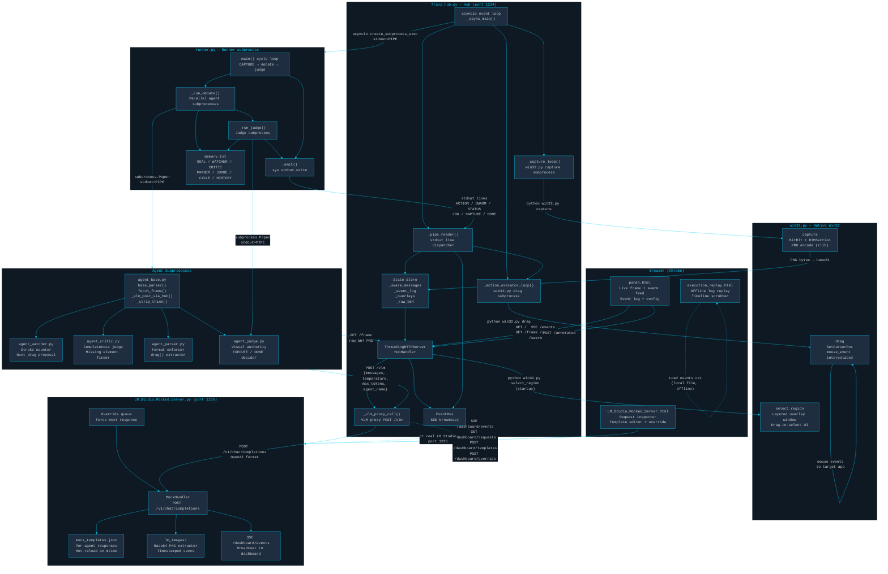

# Franz V3 — AI Agent Swarm for Autonomous Drawing


> A multi-agent AI swarm that autonomously draws on your screen using a Vision-Language Model. Agents debate each stroke, a judge approves execution, and every decision is logged and replayable.

---

## Features

- **Multi-agent debate loop** — WATCHER, CRITIC, PARSER run in parallel each cycle; JUDGE arbitrates
- **VLM vision pipeline** — every agent receives a live base64 PNG screenshot alongside shared memory
- **Async stdout pipe IPC** — runner communicates with hub via a structured line protocol over stdout
- **Hot-reloadable mock server** — `LM_Studio_Mocked_Server.py` replaces LM Studio for offline dev; templates reload on every request without restart
- **Real-time cyber dashboard** — `LM_Studio_Mocked_Server.html` shows live requests, base64 image previews, template editor, and force-override panel
- **Session replay** — `execution_replay.html` replays any `events.txt` log file with full timeline scrubbing
- **Shared memory architecture** — `memory.txt` is the single source of truth; all agents read and write named sections
- **Native Win32 capture & input** — zero-dependency screen capture, drag, click, hotkey via raw `ctypes`
- **Normalized coordinate system** — all agent coordinates are 0–1000 regardless of screen resolution
- **Continuous runner** — auto-restarts on crash; hub waits for panel connection before launching runner

---

## Architecture Overview

Franz V3 is split into three layers:

| Layer | Files | Role |
|---|---|---|
| **Hub** | `v3/franz_hub.py` | HTTP server, async event loop, pipe reader, VLM proxy, SSE bus, action executor |
| **Runner** | `v3/runner.py` | Orchestrates debate cycles, spawns agents as subprocesses, emits pipe protocol |
| **Agents** | `v3/agent_*.py` + `v3/agent_base.py` | Stateless VLM callers; read memory + frame, write one section back |
| **Win32** | `v3/win32.py` | Screen capture, drag/click/type, region selector — pure ctypes, no dependencies |
| **Memory** | `v3/memory.txt` | Shared flat-file state: GOAL, WATCHER, CRITIC, PARSER, JUDGE, CYCLE, HISTORY |
| **Panel** | `v3/panel.html` | Live browser UI served by hub; shows frame, swarm feed, event log, config |
| **Mock Server** | `LM_Studio_Mocked_Server.py` | Drop-in LM Studio replacement on port 1235; per-agent templates, image saving |
| **Mock Dashboard** | `LM_Studio_Mocked_Server.html` | Real-time GUI for the mock server; request inspector, template editor |
| **Replay** | `v3/execution_replay.html` | Offline log-driven replay of any `events.txt` session |

### VLM Proxy Flow

```
Agent subprocess
  └─ POST /vlm  →  Hub (port 1234)
                     └─ _vlm_proxy_call()
                          └─ POST /v1/chat/completions  →  LM Studio / Mock (port 1235)
                                                              └─ OpenAI response
                     └─ returns {"content": "..."}  →  Agent
```

### Pipe Protocol (runner → hub via stdout)

| Prefix | Payload | Effect |
|---|---|---|
| `ACTION:` | `drag(x1,y1,x2,y2)` | Enqueues Win32 drag action |
| `SWARM:` | `NAME\|direction\|text` | Adds message to swarm feed |
| `STATUS:` | `NAME\|thinking\|idle` | Updates agent status indicator |
| `LOG:` | `level\|message` | Appends to event log |
| `OVERLAY:` | JSON object | Adds canvas overlay annotation |
| `CAPTURE:` | *(empty)* | Triggers screen capture cycle |
| `SET_CONFIG:` | JSON patch | Hot-patches hub config at runtime |
| `DONE:` | *(empty)* | Signals task complete, stops runner |

---

## Full System Diagram



---

## User Guide

### 1. Run the Full System

**Prerequisites**

```
pip install -r requirements.txt   # no external deps for v3 core — stdlib only
```

**Step 1 — Start the mock VLM server** (or use real LM Studio on port 1235)

```bash
python LM_Studio_Mocked_Server.py
```

> Listens on `0.0.0.0:1235`. Open `LM_Studio_Mocked_Server.html` in Chrome for the live dashboard.

**Step 2 — Start the hub**

```bash
cd v3
python franz_hub.py
```

On first launch a full-screen overlay appears — drag to select the capture region, or right-click for full screen. Escape cancels.

**Step 3 — Open the panel**

```
http://127.0.0.1:1234
```

The hub waits for a browser connection before launching the runner. Once Chrome connects, the runner starts automatically.

**Skip region selection** (useful for automation):

```bash
python franz_hub.py --skip-region
```

---

### 2. Use the LM Studio Mock + Dashboard

The mock server is a drop-in replacement for LM Studio. It:

- Accepts the same `POST /v1/chat/completions` OpenAI format
- Reads `agent_name` from the request payload to select per-agent templates
- Saves any base64 images to `lm_images/` and logs the path
- Applies a configurable random delay per template

**Open the dashboard:**

```
LM_Studio_Mocked_Server.html   (open directly in Chrome — no server needed for the HTML file itself)
```

Dashboard features:
- Live requests table (SSE + 800 ms poll fallback)
- Click any row to inspect full JSON payload + rendered image preview
- Inline `mock_templates.json` editor with save button
- Force Response panel — paste any text to override the next response for a specific agent

---

### 3. Use execution_replay.html for Log Replay

```
v3/execution_replay.html   (open directly in Chrome)
```

1. Click **Load Log File** and select any `events.txt` from a session folder
2. Use the timeline scrubber to jump to any point in the session
3. Play/pause/step through events — frame images, swarm messages, and agent statuses all animate in sync
4. No server required — fully self-contained, runs from the local filesystem

**Where are session logs?**

Each run creates a timestamped folder next to `franz_hub.py`:

```
v3/sessions/YYYYMMDD_HHMMSS/
  events.txt
  memory.txt
```

---

### 4. Edit mock_templates.json

`mock_templates.json` lives in the workspace root. It hot-reloads on every request — no server restart needed.

```json
{
  "WATCHER": {
    "delay": 1.5,
    "responses": [
      "I count 3 strokes. The head circle is visible. Next: drag(200,300,400,300)"
    ]
  },
  "JUDGE": {
    "delay": 2.0,
    "responses": [
      "EXECUTE: drag(200,300,400,300)",
      "DONE"
    ]
  }
}
```

| Key | Type | Description |
|---|---|---|
| `delay` | `float` | Fixed response delay in seconds (overrides random range) |
| `responses` | `string[]` | Pool of responses; one is picked at random each call |
| `{saved_image_path}` | placeholder | Replaced with the path of the saved PNG in the response text |

Agent keys: `WATCHER`, `CRITIC`, `PARSER`, `JUDGE`, `DEFAULT` (fallback for unknown agents).

JUDGE responses must use one of:
- `EXECUTE: drag(x1,y1,x2,y2)` — approves and executes a drag
- `DONE` — signals task complete

---

### 5. Load a Real Session Log

To replay a past session:

1. Open `v3/execution_replay.html` in Chrome
2. Click **Load Log File**
3. Navigate to `v3/sessions/<timestamp>/events.txt`
4. The full session replays from the beginning

To replay in real-time alongside a live run, the panel at `http://127.0.0.1:1234` streams events live via SSE — no file loading needed.

---

## Configuration

### Hub Config (`v3/franz_hub.py` — `HubConfig` dataclass)

| Field | Default | Description |
|---|---|---|
| `server_host` | `127.0.0.1` | Hub listen address |
| `server_port` | `1234` | Hub HTTP port |
| `vlm_endpoint_url` | `http://127.0.0.1:1235/v1/chat/completions` | VLM backend URL |
| `vlm_model_name` | `qwen3.5-0.8b` | Model name sent in requests |
| `vlm_timeout_seconds` | `120` | Per-request VLM timeout |
| `vlm_request_delay_seconds` | `0.2` | Delay between VLM calls |
| `capture_width` | `640` | Capture output width (px) |
| `capture_height` | `640` | Capture output height (px) |
| `action_delay_seconds` | `0.3` | Delay after executing an action |
| `max_agent_vlm_concurrent` | `4` | Max parallel agent VLM calls |

Runtime config patches are supported via the `SET_CONFIG:` pipe command — no restart needed.

### Mock Server Config (`mock_templates.json`)

See [Edit mock_templates.json](#4-edit-mocktemplatesjson) above.

### Memory File (`v3/memory.txt`)

```
GOAL: Draw a cat.
WATCHER:
CRITIC:
PARSER:
JUDGE:
CYCLE: 0
HISTORY:
```

Edit `GOAL:` to change what the swarm draws. All other sections are written by agents each cycle.

---

## Debugging Tips

### Use the Mock Dashboard to inspect VLM calls

- Every request the hub makes to port 1235 appears in the dashboard table within ~1 second
- Click a row to see the exact messages array, temperature, max_tokens, and agent_name
- If an agent sent a screenshot, the PNG renders in the detail pane via Canvas
- Use **Force Response** to inject a specific JUDGE response (e.g. `DONE`) to stop a runaway session

### Use execution_replay.html to diagnose bad cycles

- Load the `events.txt` from a session where the drawing went wrong
- Step through cycle by cycle using the frame-by-frame controls
- Compare WATCHER / CRITIC / PARSER outputs in the swarm feed against the canvas frame at that moment
- The JUDGE decision and the resulting `ACTION:drag(...)` are highlighted in the event log

### Common issues

| Symptom | Likely cause | Fix |
|---|---|---|
| Hub starts but runner never launches | Panel not connected | Open `http://127.0.0.1:1234` in Chrome |
| Agents return empty responses | Mock server not running | Start `LM_Studio_Mocked_Server.py` first |
| `seq mismatch` errors in log | Capture cycle racing | Increase `vlm_request_delay_seconds` in config |
| JUDGE never outputs `EXECUTE:` | Template missing `EXECUTE:` prefix | Edit `mock_templates.json` JUDGE responses |
| Region selector closes immediately | Escape pressed or right-click | Re-run hub; drag to select region |

---

## Roadmap

- [ ] Web-based memory editor in `panel.html`
- [ ] Multi-goal queue — feed a list of drawing tasks and run them sequentially
- [ ] Agent confidence scoring — weight JUDGE decision by per-agent agreement strength
- [ ] Export session as MP4 — render `events.txt` frames into a video
- [ ] Remote VLM support — configurable endpoint for cloud-hosted Qwen3-VL
- [ ] Agent plugin system — drop a new `agent_*.py` into `v3/` and it auto-joins the debate
